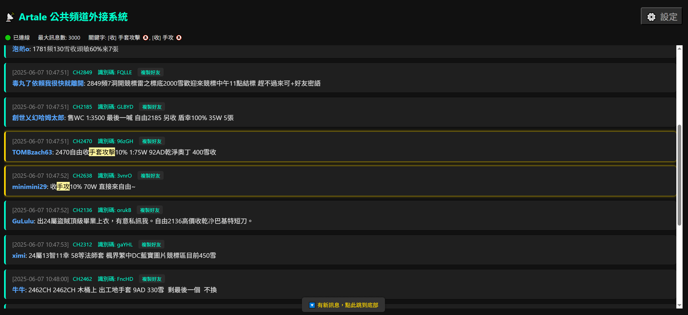

# Artale Channel Broadcast System（公共頻道外接系統）

🎮 用於楓之谷 Artale 伺服器的公共聊天訊息外接系統。透過封包分析，自動解析 TCP 封包中的頻道、暱稱、訊息等資訊，並以 WebSocket 推播給網頁前端顯示。可用於自動顯示聊天、建立好友、整合直播視覺化。

forked from: [steve07s/Artale-Channel-Broadcast-System](https://github.com/steve07s/Artale-Channel-Broadcast-System)

---

## ✅ 功能特色

- 監聽公共頻道訊息封包
- 顯示完整訊息資訊
- 支援複製好友，方便密語
- 支援設定關鍵字，自動強調符合關鍵字的訊息
- 檢測到符合關鍵字的訊息自動發送桌面通知

---

## 🚀 安裝與啟動

### 1. 安裝 Npcap (Window)
https://npcap.com/#download

### 2. 安裝 Python 套件

```bash
pip install scapy websockets
```

### 3. 啟動封包監聽 + WebSocket 廣播主程式

```bash
python server.py
```

啟動後你將看到：

```
>> 🟢 啟動 Sniffer 中（tcp port 32800） ✅ 已啟動 MapleStory 聊天 WebSocket 推播器
✅ WebSocket 推播伺服器啟動於 ws://localhost:8765
```

同時將自動打開前端展示頁 http://localhost:8000



## 📌 注意事項

* ✅ 請用管理員權限執行（封包監聽需要權限）
* ✅ 遊戲需開啟並發送聊天訊息才會擷取到封包
* 🔒 不會修改遊戲、不進行注入，純封包解析，安全穩定

---

## 📜 授權 License

MIT License